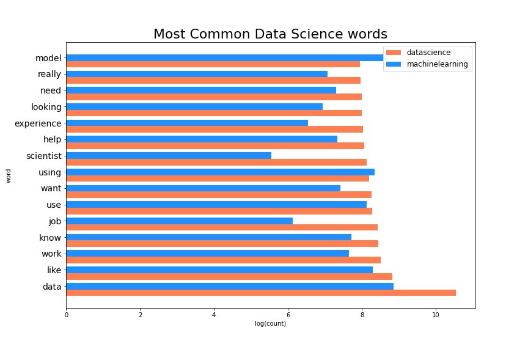
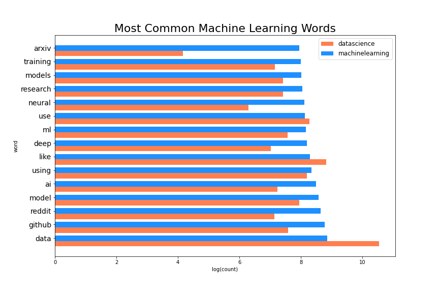
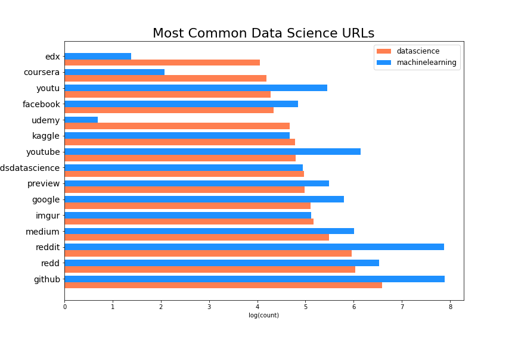
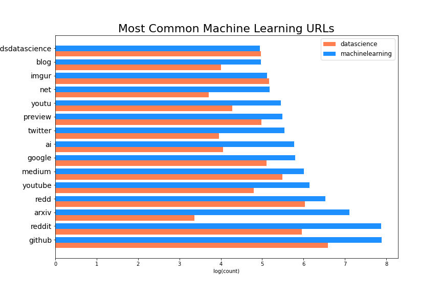
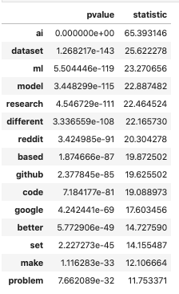
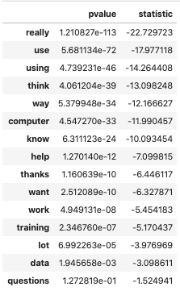
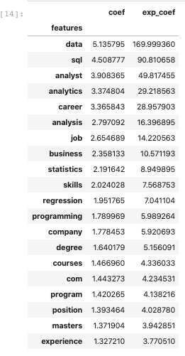
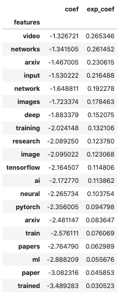

# Subreddit Classification
# r/datascience vs r/machinelearning

By Dan Ovadia

## Problem Statement
Data science as a field of study and as a profession has evolved quickly over the years in a unique way. In comparison to other fields such as software engineering and computer science expanded with the rising reliance on software and digital systems in the 21st century. Many of there fields and professions expanded with both the need for software skills and an increase in the availability of computers and accessibility of learning programming languages. 

Normally there are fundamental tools or inventions that contribute to the expansion of a field or profession. Normally there are academic foundations that help support the role. In the case of data science, the demand for data insights increased quickly and this role rapidly expanded in a void between cold, raw data, and curious and hungry businesses who lacked the tools or intellectual capital to make use of that data.

## Executive Summary
Overall it seems that the DataScience subreddit is focused on learning tools and focusing on solving issues for companies. People on the subreddit are eager for experiencies, be it work, side projects, courses, or competitions. 

The machinelearning subreddit on the other hand is a community of academics focused on solving and furthering the development of machine learning, deep learning, and ai. This is a more academic community focused on encouraging sharing papers and furthering the field of data science as a science.

Our models can be used to assess sentiments and context for strings of text, comments, or posts that include key terms or urls. The model then predicts if the comment or string of text belongs in the data science community or in the machine learning community.

## Contents
### 1. Data Collection
First we extract our data using the [P3-getting-data.ipynb](https://git.generalassemb.ly/DanOvadia/project_3/blob/master/P3-Getting-Data.ipynb). This grabs relevant data from the pushshift API, and extracts relevant features that would be useful for inference or our modeling process. Data was extracted using the [PushShift API](https://pushshift.io/api-parameters/)

### 2. Cleaning and Preparation of Data
Second we clean our data using [P3-cleaning.ipynb](https://git.generalassemb.ly/DanOvadia/project_3/blob/master/P3-cleaning.ipynb). The first cleaning operations we conduct are the following:
 - Selects only lowercase and uppercase letters from the title and selftext.
 - Extracts hypertext and HTML artifacts from title and selftext.
 - Lowercases all characters.
 - Removes stopwords.
 - Reconcatenates the string of words and inserts a clean_title and clean_selftext column.
 - Extracts full URL links from title and selftext.
 - Extracts base hostname from each URL and stores them in their own distinct columns.
 - Create a binary column for subreddit to be called later.

#### Post Cleaning Data Dictionary
| Column        | Description                                  | DataType | 
|---------------|----------------------------------------------|----------|
| title         | Subreddit submission title                   | object   |
| selftext      | Posts submission body text                   | object   |
| clean_title   | Cleaned submission title                     | object   |
| selftext_urls | Extracted and hostnames from URLs in the body| object   |
| title_urls    | Extracted hostnames from URLs in the title   | object   | 
| clean_selftext| Cleaned submission body text                 | object   | 
| created_utc   | Date the post was created                    | float    | 
| num_comments  | Number of comments on the submission         | int      |
| num_crossposts| Number of crossposts                         | int      | 
| score         | Submission score                             | int      |
| subreddit     | Original subreddit string name               | object   | 
| Subreddit_name| Subreddit's binary flag                      | int      |

The cleaning and preparation of our data took multiple steps.
 
### 3. Exploratory Data Analysis Process
Now that our data is clean and ready for examining, we can begin our EDA process. The EDA process can be found in [P3-EDA.ipynb]() notebook. 

Our exploratory process focuses on looking at word frequencies and URL hostname frequencies. 
#### Common words in title or selftext

#### Common URLS

We also ran t-tests on the most common overlapping words between ML and DS. We took the top 100 from both sets, and then found 

### T-test on the most common Machine Learning words

### T-test on the most common Data Science words

## Coefficients from pipe_v3
### Data science high coefficients

### Machine Learning high coefficients

Based on examining our data. We see that some words, such as com, www, io, org, edu, https come from being artifacts from extracting URLs. To prevent these from causing interference with our model. We will exclude them as features. 

Also there are a handful of values that occur at high rates distinguishably different from the other subreddit. To extract these, we ran a t-test, and any values that have a low p-value, and specifically those that have extremely high statistic values, were removed to prevent them from over fitting our model.

This practice dramatically improved the variance of our model. Leading to some remarkably consistenet results. 

### 4. Preprocessing and Modeling
After exploring our data and examining key coefficients and frequent words and URLS, we went back and tuned our stop words to better target the signal that interests us. We then proceeded to instantiate models and run tests to see which model may produce the best results for some interpretability. We did this work in the [P4-model.ipynb]() python notebook. 

### 5. Model Evaluation

We worked with classification models, specifically to predict which subreddit specific posts came from. The goal was also to extract URLs and other relevant information that may inform us on how the two communities behave differently. 

 - Pipeline with a Feature Union and two Function Transformers to extract specific columns for two separate Vectorizers. This was used to extract coefficients and to test the ability to include URLs into our model. 
    - Train Accuracy Score: **0.7320441063109562**
    - Test Accuracy Score: **0.7389905489644079**
    
 - TFIDF with Logistic Regression
    - Train Accuracy Score: **0.7314743439353822**
    - Test Accuracy Score: **0.7382867484415846**
    
 - TFIDF and Standard Scaler with Logistic Regression
    - Train Accuracy Score: **0.7267486677615042**
    - Test Accuracy Score: **0.7301427709632012**
    
 - TFIDF with Logistic Regression in a gridsearch to narrow down parameters. 
    - Train Accuracy Score: **0.7436069309917217**
    - Test Accuracy Score: **.7345666599638045**
    
 - SVC Model
    - Train Accuracy Score: **0.8137**
    - Test Accuracy Score: **.7909**
    
 - Gaussian Naive Bayes
     - Train Accuracy Score: **0.7057344907329826*
     - Test Accuracy Score: **0.7061130102553791**
     
 - Multinomial Naive Bayes
    - Train Accuracy Score: **0.7295974796393739**
     - Test Accuracy Score: **0.7324552583953348**
    
## Conclusions and Recommendations

Overall, we are still seeing roughly the same scores. Overall it seems that a TFIDF vectorization along with a Logistic regression is so far the best bang for our buck. We may be able to further tune our parameters, but overall these seem to be the best results we'll be abel to get for the least amount of effort. 

### Next Steps:

I would like to further examine KNN modeling, as well as possibly Forest Classifiers. We may be able to achieve more accuracy if we build on top of a forest, or bagg a handful of estimators. It would also be intriguing to use different estimators on different sets of the features available and then pack them into a VotingClassifier. 

In terms of feature exploration, I would like to further explore the other numerical columns such as score, number of comments, number of crossposts. Also conducting sentiment analysis over the posts would likely not yield much.

In terms of EDA, I would like to further examine posts over time.

In terms of expanding our data, I would like to open up to comments and introduce more of the subreddit vernacular to the training data. 

In terms of improving our models, I would like to further validate our guesses, and create a confusion matrix to examine our sensitivity and specificity.
